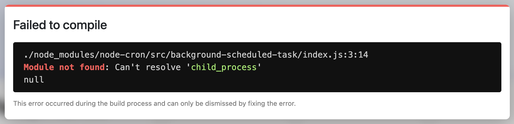

# Welcome to Weather App ⛅️

Dans le cadre d'un test de compétences, j'ai repris le projet de [@madzadev](https://github.com/madzadev/weather-app) pour modifier le comportement de l'application.

Le but pour moi était de modifier l'API présente [(Open Weather)](https://openweathermap.org/) pour [Open Meteo](https://open-meteo.com/en/docs), retirer la barre de recherche pour indiquer la ville depuis un fichier de configuration, et faire actualiser toutes les heures les données de celle-ci pour rester à jour.

Voici un aperçu de l'ancien projet créée par [@madzadev](https://github.com/madzadev/weather-app) :


## Installation 📦

> [!WARNING]
> Utilisez la version 16 de Node avec [`nvm`](https://github.com/nvm-sh/nvm) pour faire fonctionner le projet.

Installez le projet :

```bash
npm install
```

Créez un fichier `.env.local` à la racine du projet et indiquer la ville :

```ini
CITY_NAME=Paris
```

Enfin, lancez le projet :

```bash
npm run dev
```

## Open Meteo ⛅️

J'ai réussi à modifier l'API et faire afficher les données après plusieurs tentatives (je n'avais jamais encore aborder JavaScript).

Il fallait en premier lieu récupérer les données géographique (latitude, longitude) grâce la ville indiqué dans le fichier de configuration puis récupérer en second lieu les données météorologiques grâce aux coordonées.

```js
export default async function handler(req, res) {
  const getGeocoding = await fetch(
    `https://geocoding-api.open-meteo.com/v1/search?name=${process.env.CITY_NAME}&count=1&language=fr&format=json`
  );
  const geocoding = await getGeocoding.json();

  const getWeatherData = await fetch(
    `https://api.open-meteo.com/v1/forecast?latitude=${geocoding.results[0].latitude}&longitude=${geocoding.results[0].longitude}&hourly=temperature_2m,relative_humidity_2m,visibility,wind_speed_10m,wind_direction_10m,weather_code&daily=sunrise,sunset&timeformat=unixtime&timezone=auto&forecast_days=1`
  );
  const weather = await getWeatherData.json();

  res.status(200).json({
    geocoding: geocoding,
    weather: weather,
  });
}
```

En m'inspirant des données affichés dans la première version j'ai indiqué les données similaires avec cette nouvelle API grâce à la documentation.

## Services 👷🏾‍♂️

Dans le dossiers `/services/`, de nombreuses fonctions de conversion de données et autres était implémenté. J'ai du en revoir certain pour m'adapter avec les nouvelles données.

Il y avait aussi un système de conversion métrique ou impérial, j'ai préféré retiré cela et imposé le métrique.

## Node-cron ❌

J'avais aussi pour consigne d'actualiser les données de l'API toutes les heures.

J'ai découvert un package [`node-cron`](https://www.npmjs.com/package/node-cron), un petit programme de tâche, cependant en l'utilisant ce problème apparaissait :



J'ai tenté d'utiliser d'autres packages, même problème. J'ai essayé de changer ma version de Node, toujours pareil.

Je vais donc implémenter la logique dans ce README histoire de montrer comment j'aurai procédé si cela fonctionnait correctement :

```js
const cron = require("node-cron");

cron.schedule("* */1 * * *", () => {
  useEffect(() => {
    const getData = async () => {
      const res = await fetch("api/data");
      const data = await res.json();
      setWeatherData({ ...data });
    };
    getData();
  }, []);
});
```
Il y avait sûrement une solution, en tout cas personnelement j'ai trouvé que celle-là.

## Conclusion 🔚

Pour une première expérience avec Next et son fonctionnement je suis plutôt satisfait de ce que j'ai pu fournir.